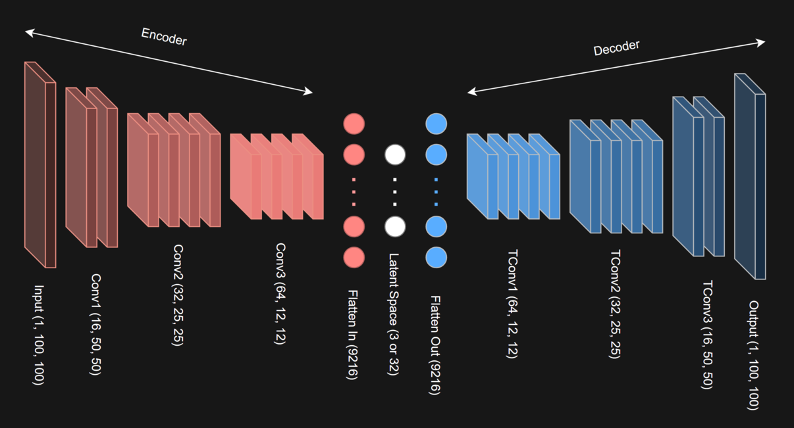

# 🧠 Anomaly Detection in Jet Images with Autoencoders

This project investigates the use of **convolutional autoencoders** for anomaly detection in **hadronic jet images** from a high-energy physics detector. We analyze 2D calorimeter images (100×100 pixels) to distinguish between **normal jets** (from quarks or gluons) and **anomalous jets** (from boosted top quark decays).

---

## 📦 Dataset

- `Normal_data.npz`: 12k images of normal jets  
- `Test_data_low.npz` and `Test_data_high.npz`: 3k events each, containing an unknown fraction of anomalies

---

## 🧩 Objectives

1. **Visualize** the latent space (reduced to 3D)
2. **Estimate** the anomaly rate using reconstruction error (MSE), ensuring FPR ≤ 10%
3. **Cluster** the latent space (e.g., with GMM)
4. **Evaluate** cluster purity against anomaly scores

---

## 🛠️ Models

We compare two convolutional autoencoders:

- **Model S**: 3D latent space (no dimensionality reduction)
- **Model L**: 32D latent space, reduced to 3D via PCA

Training is performed using `PyTorch Lightning`, while dimensionality reduction and clustering rely on `scikit-learn`.

📌 Architecture overview:

---

## 📊 Key Results

- **Model L** produces more expressive latent representations, resulting in clearer clustering with GMM.
- The resulting clusters from Model L align better with the anomaly classifications derived from reconstruction error.

---

## 🔗 Launch Notebook

You can explore the full pipeline interactively on Google Colab:  
)
> ⚠️ *Notebook and comments are written in Italian*

---

## 👥 Authors

*Michele Magrini* (2066963)  
*Julian Hendrix* (Student ID)
